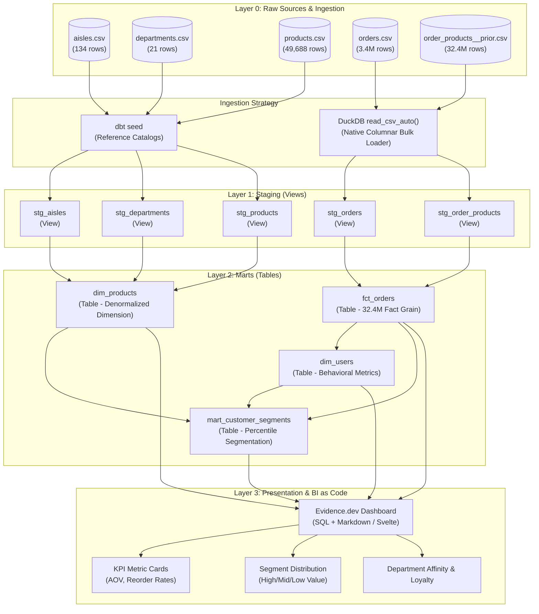

---
name: retail-analytics-interview-architecture
description: Comprehensive architecture guide and technical interview preparation handbook for the Retail Analytics project (dbt Core, DuckDB, Evidence.dev, and Instacart 32M+ dataset). Use when explaining the project architecture, dimensional modeling, dbt transformation layers, performance tuning, or answering interview questions.
---

# Retail Analytics: Architecture Deep-Dive & Technical Interview Handbook

An end-to-end technical guide and interview preparation handbook covering the modern analytics engineering stack implemented in the **Retail Analytics** project.

---

## 1. Project Overview & 2-Minute Interview Elevator Pitch

> **"Tell me about this project:"**  
> "The Retail Analytics project is an end-to-end modern data stack implementation analyzing 32+ million grocery order line items from the Instacart dataset. Built on **dbt Core** and **DuckDB**, with an interactive **Evidence.dev** BI layer, it showcases production analytics engineering best practices: a staged transformation architecture, Kimball dimensional modeling (star schema), percentile-based dynamic customer segmentation, and a 37-test automated data quality suite. By using DuckDB's vectorized columnar engine, the entire 32-million-row fact and dimensional pipeline compiles, executes, and passes full referential integrity checks in under 10 seconds locally on a laptop with zero cloud infrastructure costs."

---

## 2. End-to-End Architecture & Data Lineage



---

## 3. Detailed Component Breakdown

### 3.1 Ingestion Layer: The Hybrid ELT Strategy
- **Small Reference Data (< 5 MB)**:
  - Tables: `aisles` (134 rows), `departments` (21 rows), `products` (49,688 rows).
  - Loaded via `dbt seed`. Seeds are version-controlled in the repository, enabling reproducible dimensions without requiring external data storage.
- **Large Transactional Data (> 500 MB)**:
  - Tables: `orders` (3,421,083 rows), `order_products__prior` (32,434,489 rows).
  - Loaded using DuckDB's native vectorized C++ CSV reader: `read_csv_auto()`.
  - Avoids git bloat and overcomes the performance limitations of standard SQL multi-row `INSERT` statements by streaming directly into DuckDB's columnar format.

### 3.2 Staging Layer (`models/staging/`)
- **Materialization**: `view` (configured via `+materialized: view` in `dbt_project.yml`).
- **Core Principles**:
  1. **1-to-1 Mapping**: Exactly one staging model per raw source table.
  2. **Zero Aggregation / Joins**: Staging is reserved for hygiene and interface isolation.
  3. **Strict Type Casting & Normalization**:
     - Explicit key casting: `BIGINT` -> `INTEGER` across `order_id` and `product_id`.
     - Boolean semantics: `reordered` cast from integer (`0`/`1`) to native `BOOLEAN`.
     - String hygiene: `TRIM()` on descriptive names (`product_name`, `aisle_name`).
     - Pruning: Stripping downstream unnecessary source columns (e.g. `eval_set`).
  4. **Contract Isolation**: If raw table names or schemas change in the upstream database, only the staging layer needs updating; marts remain untouched.

### 3.3 Marts Layer (`models/marts/`)
- **Materialization**: `table` (physical columnar storage in DuckDB).
- **Architecture**:
  - `dim_products`: Denormalized product dimension pre-joining `stg_products` with `stg_aisles` and `stg_departments`. Eliminates snowflake joins in ad-hoc queries.
  - `fct_orders`: Grain is **one row per product per order** (order line item grain, 32,434,489 rows). Joins cart attributes (`add_to_cart_order`, `reordered`) with order header attributes (`user_id`, `order_dow`, `order_hour_of_day`, `days_since_prior_order`).
  - `dim_users`: Grain is **one row per user** (206,209 users). Computes user-level lifetime aggregates: `total_orders`, `total_products_ordered`, `total_reorders`, `reorder_rate`, `avg_days_between_orders`, and `avg_basket_size`.
  - `mart_customer_segments`: Grain is **one row per user**. Applies statistical percentile windowing (`PERCENTILE_CONT(0.33)` and `PERCENTILE_CONT(0.66)`) over `total_orders` and `reorder_rate` to assign behavioral tiers (`High Value`, `Mid Value`, `Low Value`) alongside top department affinity.

### 3.4 Presentation Layer: BI as Code with Evidence.dev
- **Philosophy**: Business intelligence treated with identical software engineering rigor as code—version-controlled in git, defined via Markdown and SQL, and reviewed in pull requests.
- **Connection**: Directly connects to `dev.duckdb` in read-only mode.
- **Performance Optimization**: Pre-aggregates high-cardinality fact metrics in `evidence/sources/instacart/` before passing to frontend Svelte components, keeping dashboard response times sub-second.

---

## 4. Key Architectural Decisions & Trade-Offs

| Decision | Approach Taken | Alternative Considered | Justification & Trade-Off |
|---|---|---|---|
| **Warehouse Engine** | DuckDB (Embedded Columnar) | Snowflake / BigQuery / PostgreSQL | DuckDB provides zero-latency local execution, zero cloud infrastructure costs, and out-of-core vectorized execution capable of processing 32M+ rows in under 8 seconds. Trade-off: Single-node vertical scaling rather than distributed scale. |
| **Staging Materialization** | `view` | `table` or `incremental` | Zero storage overhead, instant rebuilds, always up-to-date with raw data. No duplicated disk space for 32M raw rows. |
| **Marts Materialization** | `table` | `view` | Marts undergo complex window functions (`PERCENTILE_CONT`), aggregations (`GROUP BY user_id`), and joins. Materializing as tables pre-computes these heavy operations for sub-millisecond BI queries. |
| **Customer Segmentation** | Dynamic `PERCENTILE_CONT(0.33 / 0.66)` | Hardcoded thresholds (e.g. orders > 10) | Statistical distribution ensures segments automatically adapt to seasonal shifts or overall growth without manual code modifications. |
| **BI Tooling** | Evidence.dev (BI as Code) | Tableau / PowerBI / Looker | Version-controlled alongside dbt models, PR reviewable, SQL-native, reproducible, zero enterprise licensing cost. |

---

## 5. Comprehensive Technical Interview Questions & Answers

### Category 1: Analytics Engineering & dbt Mechanics

#### Q1: Why do we separate the staging layer from the marts layer? What goes wrong if you join raw tables directly in marts?
**Answer:**
"Separating staging from marts enforces the separation of concerns and interface abstraction:
1. **Source Decoupling**: Raw sources frequently suffer from inconsistent naming conventions, dirty formatting, and unoptimized data types. If 10 different mart models directly read from raw tables and an upstream column name changes, all 10 models break. With staging, only the staging model is modified.
2. **Standardization & Hygiene**: Staging handles 1-to-1 cleaning—renaming, casting types (e.g. `reordered` to `BOOLEAN`), trimming strings, and removing unused columns.
3. **DRY Principle (Don't Repeat Yourself)**: Shared cleansing logic is written once in staging rather than copy-pasted across multiple marts.
4. **Lineage Clarity**: In DAG visualizers, staging provides a clear boundary between ingested source contracts and dimensional business logic."

#### Q2: When should you use `view`, `table`, `incremental`, and `ephemeral` materializations in dbt?
**Answer:**
"- **View**: Light transformations, 1-to-1 staging models, or models queried infrequently. They consume no storage and guarantee real-time freshness, but can slow down downstream consumers if complex joins are involved.
- **Table**: Heavy transformations, complex aggregations, window functions, and presentation tables queried by dashboards. Tables physically store the data in columnar format, speeding up query latency at the expense of build time and storage.
- **Incremental**: Extremely large tables (hundreds of millions or billions of rows) where re-running the entire dataset on every run is cost-prohibitive. dbt appends or updates only new/modified records based on a timestamp or ID watermark.
- **Ephemeral**: CTE-like abstractions that are not created in the database at all; dbt interpolates their code directly into downstream models. Best used for light reusable snippets that do not warrant a database object."

#### Q3: How do dbt seeds work, and why shouldn't large transaction tables be seeded?
**Answer:**
"`dbt seed` loads CSV files from the `seeds/` folder into the database as physical tables.
- **Best Use Case**: Small, slowly changing reference datasets (e.g., country codes, status mappings, or product categories like our 134-row `aisles.csv` and 21-row `departments.csv`).
- **Why NOT for large transaction tables**:
  1. Git Bloat: Committing large CSVs (e.g. 550MB `order_products__prior.csv`) bloats git history and degrades repository cloning speed.
  2. Ingestion Overhead: dbt seeds insert rows via SQL statements (batches of `INSERT INTO`), which is orders of magnitude slower than native database bulk loaders. For 32 million rows, `dbt seed` could take hours or run out of memory, whereas DuckDB's `read_csv_auto()` streams and parses the data directly in seconds."

#### Q4: Explain the dbt testing framework. What is the difference between generic/schema tests and singular tests?
**Answer:**
"- **Generic Tests (Schema Tests)**: Parameterized test macros defined in YAML files (`schema.yml`) and applied directly to columns or models. dbt provides four native generic tests:
  1. `unique`: Asserts no duplicate values exist.
  2. `not_null`: Asserts no `NULL` values exist.
  3. `accepted_values`: Asserts column values belong strictly to an approved set (e.g. `['High Value', 'Mid Value', 'Low Value']`).
  4. `relationships`: Asserts foreign key referential integrity (e.g., every `product_id` in `stg_order_products` exists in `stg_products`).
- **Singular Tests**: One-off SQL queries stored in the `tests/` directory that assert specific custom business rules. A test fails if the query returns any rows (i.e. returning violation records). In this project, all 37 tests are generic schema tests asserting data integrity across primary keys, foreign relationships, and segmentation rules."

#### Q5: How does dbt determine model execution order and handle concurrency?
**Answer:**
"dbt compiles the dependency graph (DAG) by parsing `{{ ref('...') }}` and `{{ source('...', '...') }}` macros in model definitions. It creates a topological sort where models with no dependencies (or only source dependencies) run first. With the `--threads` configuration (defaulting to 1 or higher), dbt executes non-dependent branches of the DAG concurrently. For example, `stg_aisles`, `stg_departments`, and `stg_products` can all be built concurrently before `dim_products` executes."

---

### Category 2: DuckDB Internals & Columnar Data Warehouses

#### Q6: Why is DuckDB referred to as the 'SQLite of Analytics'? What makes it so fast on analytical queries?
**Answer:**
"DuckDB is an embedded, in-process analytical database engine, requiring no external server process or client-server network protocol, just like SQLite for OLTP. Its analytical speed stems from:
1. **Columnar Storage**: Data is stored and scanned by column rather than row. When querying `COUNT(DISTINCT order_id)` or `AVG(days_since_prior_order)`, DuckDB reads only the relevant column blocks into memory, ignoring all unneeded columns.
2. **Vectorized Execution (SIMD)**: DuckDB processes data in vectors (arrays of 2048 values) using tight CPU loops that fit inside CPU L1/L2 caches, minimizing instruction overhead and leveraging modern CPU SIMD instructions.
3. **Morsel-Driven Parallelism**: Work is dynamically partitioned into small batches (morsels) and scheduled across available CPU cores, providing near-linear multicore scaling.
4. **Out-of-Core Execution**: If a query or table exceeds physical RAM, DuckDB streams partitions to disk without crashing."

#### Q7: How does DuckDB handle concurrency and file locking?
**Answer:**
"DuckDB uses a **single-writer, multiple-reader** concurrency model:
- Multiple processes can simultaneously open and read a DuckDB database file (`read_only: true`).
- Only **one** process at a time can obtain an exclusive write lock.
- If a script (like `load_order_products.py`) leaves an open write connection to `dev.duckdb`, running `dbt run` will immediately fail with a database lock error. That is why connection closing (`con.close()`) is critical in ETL scripts."

---

### Category 3: Dimensional Modeling & Advanced SQL

#### Q8: What is Kimball Dimensional Modeling? What are the grains of the tables in this project?
**Answer:**
"Kimball dimensional modeling organizes data into **Fact tables** (measuring business events and processes) and **Dimension tables** (providing context, filters, and attributes).
In this project:
- `fct_orders`: **Order Line Item Grain** (one row per product per order). Captures numeric events: cart sequence, reorder flags, order timing.
- `dim_products`: **Product Grain** (one row per product). Denormalized dimension providing aisle and department hierarchy.
- `dim_users`: **Customer Grain** (one row per user). Captures customer lifetime metrics: order counts, basket sizes, and average interval days.
- `mart_customer_segments`: **Segment Grain** (one row per user). Enriched analytical mart combining customer behavior, dynamic tiers, and department affinity."

#### Q9: How does dynamic customer segmentation work using `PERCENTILE_CONT`? Why is it superior to hardcoded thresholds?
**Answer:**
"In `mart_customer_segments.sql`, we compute:
```sql
PERCENTILE_CONT(0.33) WITHIN GROUP (ORDER BY total_orders) as p33_orders,
PERCENTILE_CONT(0.66) WITHIN GROUP (ORDER BY total_orders) as p66_orders,
PERCENTILE_CONT(0.33) WITHIN GROUP (ORDER BY reorder_rate) as p33_reorder,
PERCENTILE_CONT(0.66) WITHIN GROUP (ORDER BY reorder_rate) as p66_reorder
```
- **Mechanism**: `PERCENTILE_CONT` evaluates the exact 33rd and 66th percentiles across the continuous distribution of all 206,209 users. Users are then categorized into `Low Value` (< p33), `Mid Value` (p33–p66), and `High Value` (>= p66).
- **Advantage over static thresholds**: Hardcoded cutoffs (e.g. `total_orders >= 10`) become obsolete as the user base matures or during holiday promotions. Percentile-based thresholds dynamically scale with the dataset distribution, guaranteeing balanced cohorts regardless of aggregate volume."

#### Q10: How do you handle referential integrity in an analytical data warehouse where primary/foreign key constraints are not enforced?
**Answer:**
"Unlike OLTP systems (e.g., PostgreSQL) which enforce strict foreign key constraints at insertion time and reject invalid records, modern OLAP warehouses (DuckDB, Snowflake, BigQuery) intentionally do not enforce foreign keys to maintain maximum ingestion throughput.
Integrity is guaranteed upstream through automated data testing:
In `schema.yml`, we define `relationships` tests:
```yaml
- name: product_id
  tests:
    - relationships:
        to: ref('stg_products')
        field: product_id
```
If an order references a nonexistent `product_id`, the test fails during CI/CD before the bad data reaches production or BI dashboards."

---

### Category 4: Business Intelligence & BI as Code

#### Q11: What is 'BI as Code', and how does Evidence.dev work?
**Answer:**
"BI as Code applies software engineering principles to dashboarding:
1. **Version Control**: Dashboards are authored in markdown (`index.md`) with embedded SQL blocks (`sql customer_segments`) and checked into git.
2. **Reviewability**: Changes to charts, queries, or metric definitions are reviewed through Pull Requests and git diffs, eliminating silent dashboard breakage.
3. **CI/CD Integration**: Dashboards can be automatically built, type-checked, and deployed using automated pipelines.
4. **Performance via Pre-aggregation**: Evidence compiles markdown to static web pages (Svelte), pre-executing SQL queries against DuckDB during build and bundling optimized parquet files for instant client-side rendering."

#### Q12: What key business findings did this analysis uncover?
**Answer:**
"The analysis revealed four major behavioral insights:
1. **Extreme Loyalty Divergence**: `High Value` customers place 8x more orders and reorder at 2.5x the rate of `Low Value` customers.
2. **Produce Department Dominance**: Fresh produce dominates order volume across every customer segment, making fresh grocery quality the primary retention driver.
3. **Correlation of Frequency and Loyalty**: Order frequency and reorder rate are strongly positively correlated—frequent shoppers reorder existing items rather than purely exploring new SKUs.
4. **Basket Size Stabilization**: Across all cohorts, basket size stabilizes at approximately 10 items by the 5th order, demonstrating predictable cart volume once user onboarding concludes."

---

### Category 5: Scenario & Performance Engineering Questions

#### Q13: How would you scale this pipeline if data volume grew from 32 Million to 3.2 Billion rows?
**Answer:**
"To scale by two orders of magnitude:
1. **Incremental Models**: Convert `fct_orders` to `+materialized: incremental` using `unique_key = ['order_id', 'product_id']` and filter on `days_since_prior_order` or order timestamps to process only new daily batches.
2. **Partitioning & File Formats**: Store raw transactions in partitioned Parquet files (`year=YYYY/month=MM/*.parquet`) on cloud object storage (S3/GCS).
3. **Compute Migration**: Migrate the dbt adapter from `dbt-duckdb` to a distributed cloud data warehouse such as **Snowflake**, **BigQuery**, or **Databricks**, with dbt orchestrating parallel cluster execution.
4. **Pre-Aggregated Summary Marts**: Build pre-aggregated rollups (e.g. daily department metrics, user-monthly summaries) so downstream dashboards never scan the raw billions of rows."

#### Q14: How would you debug a failed `unique` test on `order_id` in `stg_orders`?
**Answer:**
"1. Review the compiled test query generated by dbt in `target/compiled/retail_analytics/models/staging/schema.yml/unique_stg_orders_order_id.sql`.
2. Execute the query directly against DuckDB:
   ```sql
   SELECT order_id, COUNT(*)
   FROM main.stg_orders
   GROUP BY order_id
   HAVING COUNT(*) > 1;
   ```
3. Inspect the duplicate rows in the raw `orders` table to determine root cause:
   - Did upstream pipeline ingestion duplicate records?
   - Is `order_id` reused across distinct systems or tenants?
4. Resolve by adding deduplication logic (`QUALIFY ROW_NUMBER() OVER (PARTITION BY order_id ORDER BY ingested_at DESC) = 1`) or amending the composite primary key definition."

---

## 6. How to Use This Skill During Interview Preparation

- **For Architecture Interviews**: Review Sections 2, 3, and 4 to explain the end-to-end data lifecycle from raw CSV ingestion to dimensional modeling and BI presentation.
- **For Analytics Engineering / dbt Technical Screens**: Review Section 5 (Category 1 & 3) covering staging vs marts, materializations, testing, and DAG dependencies.
- **For Database & Data Systems Questions**: Review Section 5 (Category 2 & 5) covering columnar vs row-oriented engines, DuckDB internals, and out-of-core vectorized execution.
- **For Business & Analytics Narrative**: Review Section 5 (Category 4) to demonstrate strong product sense and business impact.